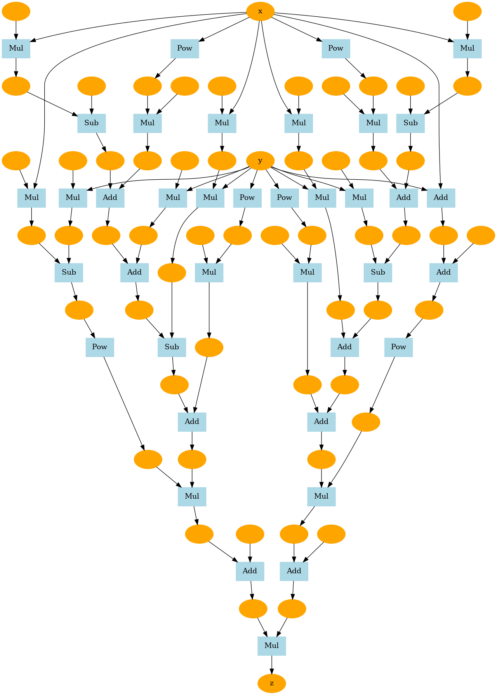

# DeZero-Kai の実装 その7

## Step 25. 計算グラフの可視化 その1
Graphviz という可視化ツールを使って計算グラフを可視化します。
Graphviz では DOT 言語を使ってグラフの構造を記述します。
詳細な文法の説明は省きますが、以下のように記述して、コマンドを実行することでグラフを作成できます。

```bash
$ dot sample.dot -T png -o sample.png
```


<div align="center">
    
</div>

## Step 26. 計算グラフの可視化 その2
まずは、変数ノードのフォーマットを整える関数を用意します。

```dzrkai/utils.py```
```python
def _dot_var(v, verbose=False):
    dot_var = '{} [label="{}", color=orange, style=filled]\n'
    
    name = '' if v.name is None else v.name
    if verbose and v.data is not None:
        if v.name is not None:
            name += ': '
        name += str(v.shape) + ' ' + str(v.dtype)

    return dot_var.format(id(v), name)
```

同様に、関数のフォーマットを整える関数も用意します。
こちらでは、関数のノードだけでなく、変数と関数の接続関係についても列記していきます。

```dzrkai/utils.py```
```python
def _dot_func(f):
    dot_func = '{} [label="{}", color=lightblue, style=filled, shape=box]\n'
    txt = dot_func.format(id(f), f.__class__.__name__)

    dot_edge = '{} -> {}\n'
    for x in f.inputs:
        txt += dot_edge.format(id(x), id(f))
    for y in f.outputs:
        txt += dot_edge.format(id(f), id(y()))

    return txt
```

これらの関数を呼び出して、DOT 言語で書かれたグラフ情報を取得する関数を定義します。
グラフ出力を引数として受け取り、そこから計算グラフをたどって、全ての変数と関数の接続関係を抽出します。

```dzrkai/utils.py```
```python
def get_dot_graph(output, verbose=True):
    txt = ''
    funcs = []
    seen_set = set()

    def add_func(f):
        if f not in seen_set:
            funcs.append(f)
            seen_set.add(f)

    add_func(output.creator)    
    txt += _dot_var(output, verbose)
    while funcs:
        func = funcs.pop()
        txt += _dot_func(func)
        for x in func.inputs:
            txt += _dot_var(x, verbose)

            if x.creator is not None:
                add_func(x.creator)

    return 'digraph g {\n' + txt + '}'
```

最後に、上の関数が出力したテキストから画像を出力できるようにしておきます。

```dzrkai/utils.py```
```python
def plot_dot_graph(output,verbose=True, to_file='graph.png'):
    dot_graph = get_dot_graph(output, verbose)

    # dot ファイルにテキストを保存
    tmp_dir = os.path.join(os.path.expanduser('~', '.dezero-kai'))
    if not os.path.exists(tmp_dir):
        os.mkdir(tmp_dir)
    
    graph_path = os.path.join(tmp_dir, 'tmp_graph.dot')
    with open(graph_path, "w") as f:
        f.write(dot_graph)

    # dot コマンドで画像出力
    extention = os.path.splitext(to_file)[1][1:]    # 拡張子の取得
    cmd = 'dot {} -T {} -o {}'.format(graph_path, extention, to_file)
    subprocess.run(cmd, shell=True)
```

この関数を使って、```Goldstein``` 関数を可視化してみます。

<div align="center">
    
</div>

## Step 27. テイラー展開の微分
まず、$y = sin(x)$ を実装してみましょう。
$\frac{\partial y}{\partial x} = cos(x)$ なので、以下のようになります。

```python
class Sin(Function):
    def forward(self, x):
        y = np.sin(x)
        return y
    
    def backward(self, gy):
        x = self.inputs[0].data
        gx = gy * np.cos(x)
        return gx


def sin(x):
    return Sin()(x)
```

ここで、テイラー展開について見てみいきましょう。
テイラー展開とは、$f^{\prime}$ を1階微分、$f^{\prime\prime}$ を2階微分、$f^{\prime\prime\prime}$ を3階微分として、$f(x)$ を以下のように近似できるという多項式近似式です。

$$
f(x) = f(a) + f^{\prime}(a)(x-a) + \frac{1}{2!}f^{\prime\prime}(a)(x-a)^2 + \frac{1}{3!}f^{\prime\prime\prime}(a)(x-a)^3+\cdots
$$

$a$ は任意の値であり、$a=0$ の場合を特にマクローリン展開とも呼びます。

$$
f(x) = f(0) + f^{\prime}(0)x + \frac{1}{2!}f^{\prime\prime}(0)x^2 + \frac{1}{3!}f^{\prime\prime\prime}(0)x^3+\cdots
$$

これを $f(x)=sin(x)$ に適用すると、以下の式が得られます。

$$
sin(x) = \frac{x}{1!} - \frac{x^3}{3!} + \frac{x^5}{5!} + \cdots = \sum_{i=0}^{\infty}(-i)^i\frac{x^{2i+1}}{(2i+1)!}
$$

この式をもとに $sin(x)$ の近似値を求める関数は、以下のようになります。

```python
def my_sin(x, threshold=0.0001):
    y = 0
    for i in range(100000):
        c = (-1) ** i / math.factorial(2 * i + 1)
        t = c * x ** (2 * i + 1)
        y = y + t
        if abs(t.data) < threshold:
            break
    return y
```

この関数でも、上で実装した ```Sin``` 関数クラスと同じくらいの精度で演算が可能です。