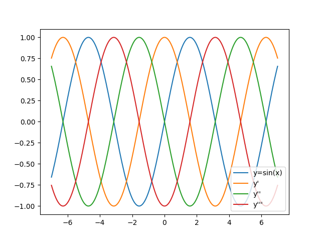

# DeZero-Kai の実装 その8

## Step 34. $sin$ 関数の高階微分
$y=sin(x)$ の微分は $\frac{\partial y}{\partial x}=cos(x)$ なので、```Sin``` 関数クラスは以下のように定義できます。

```dzrkai/functions.py```
```python
class Sin(Function):
    def forward(self, x):
        y = np.sin(x)
        return y
    
    def backward(self, gy):
        x, = self.inputs
        gx = gy * cos(x)
        return gx
    
def sin(x):
    return Sin(x)
```

上記の実装からもわかる通り、$sin$ の微分を計算するには $cos$ の実装も必要です。
$y=cos(x)$ の微分は $\frac{\partial y}{\partial x}=-sin(x)$ なので、実装は以下の通りです。

```dzrkai/functions.py```
```python
class Cos(Function):
    def forward(self, x):
        y = np.cos(x)
        return y
    
    def backward(self, gy):
        x, = self.inputs
        gx = gy * -sin(x)
        return gx
    
def cos(x):
    return Cos()(x)
```

これで、$y=sin(x)$ の高階微分が求められるようになったので、4階微分まで計算してプロットすると、下の図のようになります。

<div align="center">
    
</div>

## Step 35. 高階微分の計算グラフ
ここでは、$tanh$ 関数 (ハイパボリックタンジェント、双曲線正接) の高階微分について考えます。
$tanh$ 関数は以下のように表されます。

$$
y = tanh(x) = \frac{e^x - e^{-x}}{e^x + e^{-x}}
$$

この関数の微分は次のように求められます。

$$
\frac{\partial y}{\partial x} = \frac{(e^x + e^{-x})^2 - (e^x - e^{-x})^2}{(e^x + e^{-x})^2} = 1-\biggl(\frac{e^x - e^{-x}}{e^x + e^{-x}}\biggr)^2 = 1 - y^2
$$

よって、```Tanh``` クラスは以下のように実装できます。

```dzrkai/functions.py```
```python
class Tanh(Function):
    def forward(self, x):
        y = np.tanh(x)
        return y
    
    def backward(self, gy):
        y = self.outputs[0]()
        gx = gy * (1 - y * y)
        return gx

def tanh(x):
    return Tanh()(x)
```

高階微分を計算するとき、逆伝播を繰り返すたびに対応する計算グラフが生成されるため、計算グラフが指数関数的に複雑になります。
例えば、$tanh$ 関数の6階微分の計算グラフは以下の図のようになります。

<div align="center">
    
</div>

## Step 36. 高階微分以外の用途
逆伝播の計算について計算グラフを構築することで、高階微分の計算以外にもご利益があります。
例えば、以下の2式で与えられる変数 $z$ について、 $x=2.0$ の時の $\frac{\partial z}{\partial x}$ の値を求めることを考えます。

$$
y = x^2, z=\biggl(\frac{\partial y}{\partial x}\biggr)^3+y
$$

手計算では、$z=8x^3+x^2$ なので $\frac{\partial z}{\partial x} = 24x^2+2x$ となり、$x=2.0$ の時の微分は $100.0$ と計算できます。
一方、DeZero-Kai では以下のように計算できます。

```python
x = Variable(np.array(2.0))
y = x ** 2
y.backward(create_graph=True)
gx = x.grad
x.cleargrad()

z = gx ** 3 + y
z.backward()
print(x.grad)   # variable(100.0)
```

このように、ある微分の式を求め、その微分を含む計算式の微分を求めるような問題で、逆伝播の計算グラフを作成しておくことは非常に有効です。
この問題設定は WGAN-GP や MAML、TRPO などの深層学習モデルでも利用されています。