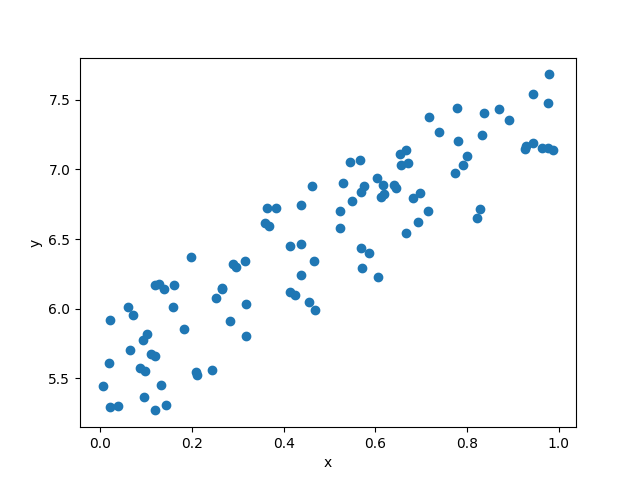
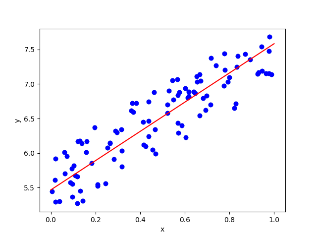

# DeZero-Kai の実装 その11

## Step 41. 行列の積
ここでは、ベクトルの内積と行列の積について見ていきます。
まず、$n$ 次元のベクトル $\bold a = (a_1, a_2, \cdots, a_n)$、$\bold b = (b_1, b_2, \cdots, b_n)$ の内積は以下の式で与えられます。

$$
\bold a \bold b = a_1 b_1 + a_2 b_2 + \cdots + a_n b_n = \sum_{i=1}^{n} a_i b_i
$$

また、$n \times m$ 行列 $A$ と $m \times p$ 行列 $B$ との行列積 $C=AB$ は $n \times p$ 行列となり、行列 $C$ の $(i, j)$ 成分 $c_{ij}$ は以下の式で与えられます。

$$
c_{ij} = \sum_{k=1}^{m} a_{ik} b_{kj}
$$

ベクトルの内積は、$n=p=1$ の場合と同じなので、以降では行列積について考えます。
実装時の変数名に合わせて、$N \times D$ 行列を $x$、$D \times H$ 行列を $W$ とし、その積を $y = xW$ とします。
この時、$y$ は $N \times H$ 行列になります。
最終的な出力 $L$ について、$x$ の第 $(i, j)$ 成分 $x_{ij}$ に関する微分 $\frac{\partial L}{\partial x_{ij}}$ は以下の式で与えられます。

$$
\frac{\partial L}{\partial x_{ij}} = \sum_{n=1}^{N} \sum_{h=1}^{H} \frac{\partial L}{\partial y_{nh}} \frac{\partial y_{nh}}{\partial x_{ij}} = \sum_{h=1}^{H} \frac{\partial L}{\partial y_{ih}} W_{jh}
$$

よって、出力 $L$ の行列 $x$ に関する微分 $\frac{\partial L}{\partial x}$ は以下の式で表されます。

$$
\frac{\partial L}{\partial x} = \frac{\partial L}{\partial y} W^T
$$

同様に、出力 $L$ の行列 $W$ に関する微分 $\frac{\partial L}{\partial W}$ は以下の通りです。

$$
\frac{\partial L}{\partial W} = x^T \frac{\partial L}{\partial y}
$$

以上をもとに、行列積を計算する ```MatMul```  関数クラスは次のように定義できます。

```dzrkai/functions.py```
```python
class MatMul(Function):
    def forward(self, x, W):
        y = x.dot(W)
        return y
    
    def backward(self, gy):
        x, W = self.inputs
        gx = matmul(gy, W.T)
        gW = matmul(x.T, gy)
        return gx, gW
    

def matmul(x, W):
    return MatMul()(x, W)
```

## Step 42. 線形回帰
これまでの実装内容を用いて、線形回帰問題を解いてみましょう。
以下のコードで発生させた2変数のトイデータを用いて実験を行います。

```python
np.random.seed(0)
x = np.random.rand(100, 1)
y = 5 + 2 * x + np.random.rand(100, 1)
```

<div align="center">
    
</div>

回帰分析とは入力データから数値の予測を行う問題のことで、特に線形回帰では与えられた2つ以上の変数間の関係を線形関数で表す手法です。
$x$ と $y$ の2変数の場合には、変数間に $y=f(x)=Wx+b$ という直線を仮定し、データと予測値の差 (残差、residual) が最も小さくなるような $W$ と $b$ を求めます。
より具体的には、以下の式で与えられる、データと予測値の2乗誤差の平均 (平均2乗誤差、mean squared error) を損失関数 $L$ として、損失関数を最小化する $W$ と $b$ を探索します。

$$
L = \frac{1}{N} \sum_{i=1}^{N} (f(x_i) - y_i)^2
$$

上の式で $(x_i, y_i)$ は $N$ 個のデータ点を表しています。  
それでは、まず $x$ から $y$ の値を予測する関数 ```predict``` と、平均2乗誤差を計算する関数 ```mean_squared_error``` を定義します。

```python
def predict(x):
    y = F.matmul(x, W) + b
    return y

def mean_squared_error(x0, x1):
    diff = x0 - x1
    return F.sum(diff ** 2) / len(diff)
```

$W$ と $b$ の初期値を $0$、学習率 $lr$ を $0.1$ として、勾配降下法で学習してみましょう。

```python
W = Variable(np.zeros((1, 1)))
b = Variable(np.zeros((1, )))
lr = 0.1
iters = 100

for i in range(iters):
    y_pred = predict(x)
    loss = mean_squared_error(y, y_pred)

    W.cleargrad()
    b.cleargrad()
    loss.backward()

    W.data -= lr * W.grad.data
    b.data -= lr * b.grad.data

    print("iter ", i, ": ", W, b, loss)
```

100回のイテレーションで、$W=2.11807369$、$b=5.46608905$ となり、$loss=0.079$ まで損失関数が小さくなります。
この直線をプロットすると、次の図のようになります。

<div align="center">
    
</div>

最後に、```mean_squared_error``` 関数を ```Function``` を継承した関数クラスとして定義しなおしておきます。
これによって、途中の計算グラフのメモリ使用量を削減できます。

```dzrkai/functions.py```
```python
class MeanSquaredError(Function):
    def forward(self, x0, x1):
        diff = x0 - x1
        y = (diff ** 2).sum() / len(diff)
        return y
    
    def backward(self, gy):
        x0, x1 = self.inputs
        diff = x0 - x1
        gy = broadcast_to(gy, diff.shape)
        gx0 = gy * diff * (2. / len(diff))
        gx1 = -gx0
        return gx0, gx1
    

def mean_squared_error(x0, x1):
    return MeanSquaredError()(x0, x1)
```