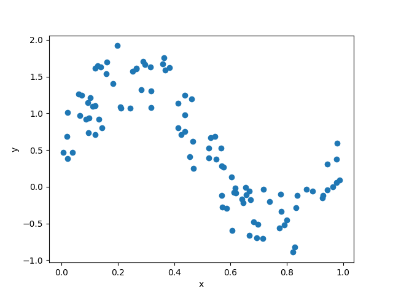
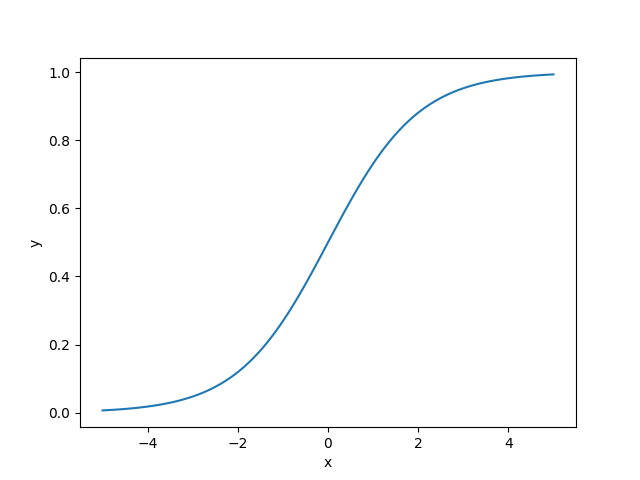
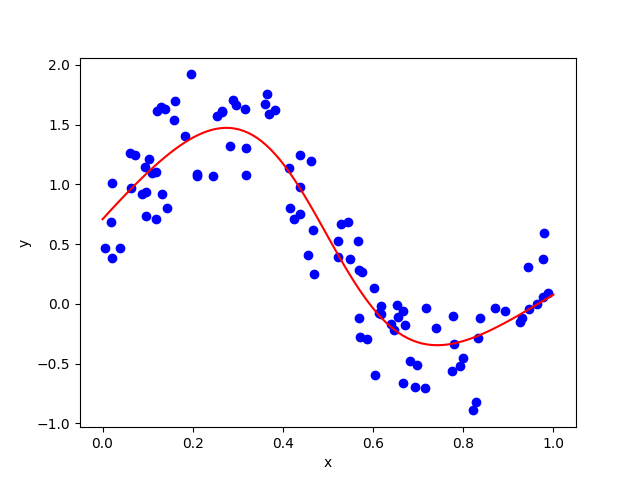

# DeZero-Kai の実装 その12

## Step 43. ニューラルネットワーク
今回は、簡単なニューラルネットワークを実装してみます。
それに先立って、```linear``` 関数を実装します。
```linear``` 関数は、$y = Wx + b$ という計算を行う関数で、これを線形変換 (linear transformation) やアフィン変換 (affine transformation) と呼びます。
```Linear``` 関数クラスと ```linear``` 関数は以下のように実装できます。

```dzrkai/functions.py```
```python
class Linear(Function):
    def forward(self, x, W, b):
        y = x.dot(W)
        if b is not None:
            y += b
        return y
    
    def backward(self, gy):
        x, W, b = self.inputs
        gx = matmul(gy, W.T)
        gW = matmul(x.T, gy)
        gb = None if b.data is None else sum_to(gy, b.shape)
        return gx, gW, gb
    
def linear(x, W, b=None):
    return Linear()(x, W, b)
```

あるいは、以下のような関数で同一の処理を実装することも可能です。

```dzrkai/functions.py```
```python
def linear_simple(x, W, b=None):
    t = matmul(x, W)
    if b is None:
        return t
    
    y = t + b
    t.data = None # 必要のないメモリを解放
    return y
```

次に、実験用のデータを用意します。
ここでは、線形回帰では対応できない非線形なデータを生成します。

```python
np.random.seed(0)
x = np.random.rand(100, 1)
y = np.sin(2 * np.pi * x) +np.random.rand(100, 1)
```

<div align="center">
    
</div>

ニューラルネットワークでは、線形変換の出力に対して活性化関数 (activation function) を適用して、非線形な変換を行います。
活性化関数には ReLu や Sigmoid など様々な種類がありますが、ここでは Sigmoid 関数を用います。
Sigmoid 関数は以下の式で与えられ、0から1の値を取ります。

$$
y=\frac{1}{1 + exp(-x)} \\
\frac{\partial y}{\partial x}=\frac{exp(-x)}{\bigl(1 + exp(-x)\bigr)^2}=y(1-y)
$$

```dzrkai/functions.py```
```python
class Sigmoid(Function):
    def forward(self, x):
        y = 1 / (1 + np.exp(-x))
        return y
    
    def backward(self, gy):
        y = self.outputs[0]()
        gx = gy * y * (1 - y)
        return gx

def sigmoid(x):
    return Sigmoid()(x)
```

<div align="center">
    
</div>

必要なものがそろったので、ニューラルネットワークを実装していきます。
ニューラルネットワークは、線形関数と活性化関数を交互につなぎ合わせて構築します。
ここでは、以下のような2層のニューラルネットワークを実装し、学習を行います。

```python
I, H, O = 1, 10, 1
W1 = Variable(0.01 * np.random.rand(I, H))
b1 = Variable(np.zeros(H))
W2 = Variable(0.01 * np.random.rand(H, O))
b2 = Variable(np.zeros(O))

def predict(x):
    y = F.linear(x, W1, b1)
    y = F.sigmoid(y)
    y = F.linear(y, W2, b2)
    return y
```

今回は学習率を $0.2$ として、10000イテレーションの学習を行います。
損失関数には線形関数と同様、平均2乗誤差を利用します。

```python
lr = 0.2
iters = 10000

for i in range(iters):
    y_pred = predict(x)
    loss = F.mean_squared_error(y, y_pred)

    W1.cleargrad()
    b1.cleargrad()
    W2.cleargrad()
    b2.cleargrad()
    loss.backward()

    W1.data -= lr * W1.grad.data
    b1.data -= lr * b1.grad.data
    W2.data -= lr * W2.grad.data
    b2.data -= lr * b2.grad.data

    if i % 1000 == 0:
        print("(iter: ", i, ") loss: ", loss)
```

10000回のイテレーションののち、以下のような結果が得られます。

<div align="center">
    
</div>