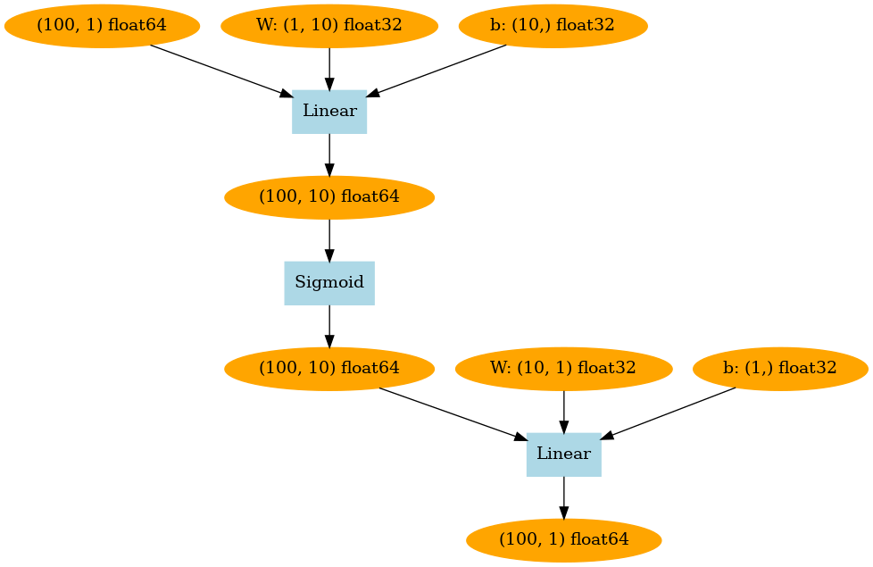

# DeZero-Kai の実装 その13

## Step 45. レイヤをまとめるレイヤ
Step 44 では、パラメータをまとめて管理できるようにしましたが、今後、扱うレイヤが増えていくことを考慮して、複数のレイヤをまとめて管理できるようにします。
具体的には、```Layer``` クラスの中で ```_params``` に、他の ```Layer``` クラスのインスタンスを保持できるように変更します。

```dzrkai/layers.py```
```python
class Layer:
    ...

    def __setattr__(self, name, value):
        if isinstance(value, (Parameter, Layer)):
            self._params.add(name)
        super().__setattr__(name, value)
    
    def params(self):
        for name in self._params:
            obj = self.__dict__[name]
            if isinstance(obj, Layer):
                yield from obj.params()
            else:
                yield obj
```

この変更によって、次に示すような記述が可能となります。

```python
# モデルの定義
model = Layer()
model.l1 = L.Linear(5)
model.l2 = L.Linear(3)

# モデルを用いた推論
def predict(model, x):
    y = model.l1(x)
    y = F.sigmoid(y)
    y = model.l2(y)
    return y

# パラメータへのアクセス
for p in model.params():
    print(p)
    
# すべてのパラメータの勾配をリセット
model.cleargrads()
```

このように、```Layer``` クラスからモデルを作ることもできますが、モデル定義のベースとなる ```Model``` クラスを用意しておきます。
```Model``` クラスは ```Layer``` クラスを継承し、モデルの計算グラフを可視化する ```plot``` メソッドを持ちます。

```dzrkai/models.py```
```python
from dzrkai import Layers
from dzrkai import utils

class Model(Layer):
    def plot(self, *inputs, to_file='model.png'):
        y = self.forward(*inputs)
        return utils.plot_dot_graph(y, verbose=True, to_file=to_file)
```

この ```Model``` クラスを継承した ```TwoLayerNet``` クラスを作成し、前のステップと同じ問題を解いてみます。

```python
# データの生成
np.random.seed(0)
x = np.random.rand(100, 1)
y = np.sin(2 * np.pi * x) +np.random.rand(100, 1)

# ハイパーパラメータの設定
lr = 0.2
iters = 10000
hidden_size = 10

# モデルの定義
class TwoLayerNet(Model):
    def __init__(self, hidden_size, out_size):
        super().__init__()
        self.l1 = L.Linear(hidden_size)
        self.l2 = L.Linear(out_size)
        
    def forward(self, x):
        y = F.sigmoid(self.l1(x))
        y = self.l2(y)
        return y
    
# モデルのインスタンス作成
model = TwoLayerNet(hidden_size, 1)

# 学習の開始
for i in range(iters):
    y_pred = model(x)
    loss = F.mean_squared_error(y, y_pred)

    model.cleargrads()
    loss.backward()

    for p in model.params():
        p.data -= lr * p.grad.data

    if i % 1000 == 0:
        print("(iter: ", i, ") loss: ", loss)
```

```TwoLayerNet``` を可視化すると以下のようになります。

<div align="center">
    
</div>

今回のように、層数に合わせて毎回新しいクラスを定義しても良いのですが、より汎用的に利用できる ```MLP``` クラスを実装しておきます。
MLP は Multi-Layer Perceptron (多層パーセプトロン) のことです。

```dzrkai/models.py```
```python
class MLP(Model):
    def __init__(self, fc_output_sizes, activation=F.sigmoid):
        super().__init__()
        self.activation = activation
        self.layers = []

        for i, out_size in enumerate(fc_output_sizes):
            layer = L.Linear(out_size)
            setattr(self, 'l' + str(i), layer)
            self.layers.append(layer)

    def forward(self, x):
        for l in self.layers[:-1]:
            x = self.activation(l(x))
        return self.layers[-1](x)
```