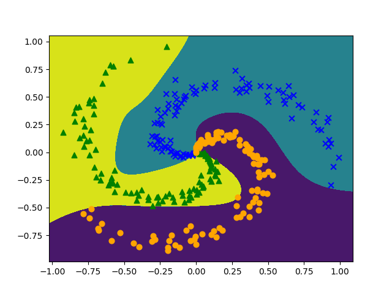

# DeZero-Kai の実装 その17

## Step 48. 多値分類
前のステップまでで多値分類問題を解く準備が整いました。
ここでは、「ゼロから作るディープラーニング 3」で提供されているトイデータで、多値分類問題を解いてみます。
まず、トイデータは以下の関数で与えられる Spiral データセットです。

```python
def get_spiral(train=True):
    seed = 1984 if train else 2020
    np.random.seed(seed=seed)

    num_data, num_class, input_dim = 100, 3, 2
    data_size = num_class * num_data
    x = np.zeros((data_size, input_dim), dtype=np.float32)
    t = np.zeros(data_size, dtype=int)

    for j in range(num_class):
        for i in range(num_data):
            rate = i / num_data
            radius = 1.0 * rate
            theta = j * 4.0 + 4.0 * rate + np.random.randn() * 0.2
            ix = num_data * j + i
            x[ix] = np.array([radius * np.sin(theta),
                              radius * np.cos(theta)]).flatten()
            t[ix] = j
    # Shuffle
    indices = np.random.permutation(num_data * num_class)
    x = x[indices]
    t = t[indices]
    return x, t
```

<div align="center">
    
</div>

学習にあたって、まずはハイパーパラメータの設定と、モデルやオプティマイザの生成を行います。

```python
# ハイパーパラメータの設定
lr = 1.0
max_epoch = 300
batch_size = 30
hidden_size = 10

# モデルとオプティマイザの生成
model = MLP((hidden_size, 3))
optimizer = optimizers.SGD(lr).setup(model)
```

```batch_size``` は1度に処理するデータ数のことで、一通りデータを全部見たときを 1 エポックと呼び、データを繰り返し見る回数を ```max_epoch``` で宣言します。
実施に学習を行うコードは以下のようになります。

```python
# 学習
data_size = len(x_train)
max_iter = math.ceil(data_size / batch_size)
for epoch in range(max_epoch):
    # データのインデックスをシャッフル
    index = np.random.permutation(data_size)
    sum_loss = 0

    for i in range(max_iter):
        # ミニバッチとしてデータを取り出す
        batch_index = index[(i * batch_size):((i + 1) * batch_size)]
        batch_x = x_train[batch_index]
        batch_t = t_train[batch_index]

        # 順伝播と逆伝播の計算とパラメータの更新
        y = model(batch_x)
        loss = F.softmax_cross_entropy(y, batch_t)
        model.cleargrads()
        loss.backward()
        optimizer.update()

        sum_loss += float(loss.data) * len(batch_t)

    # 学習経過の表示
    avg_loss = sum_loss / data_size
    print("epoch %d: loss %.2f" % (epoch + 1, avg_loss))
```

上記のプログラムで学習を行うと、下のグラフのように損失関数 (```avg_loss```) の値が下がっていくのがわかります。

<div align="center">
    
</div>

また、学習結果の決定境界をプロットすると以下のようになり、渦巻構造をうまく学習できていることがわかります。

<div align="center">
    
</div>