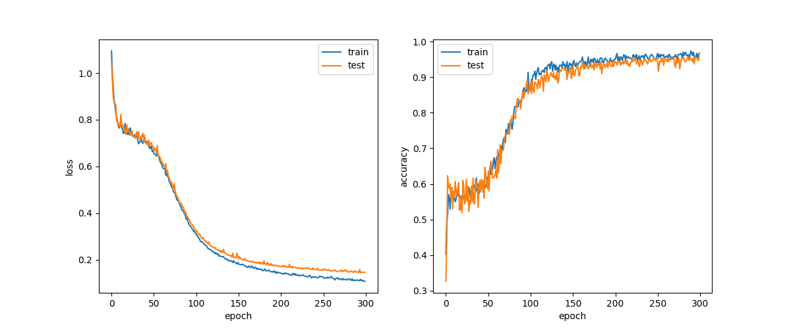

# DeZero-Kai の実装 その18

## Step 49. Dataset クラスと前処理
これまで、学習を行う際にはデータを1つの ndarray インスタンスに保持していました。
数が少ないうちは問題はありませんが、データ数が増えてくるとメモリ上にデータを展開できなくなってしまいます。
そこで、データを適切に処理するための ```Datase``` クラスを用意します。
```Dataset``` は基底クラスとして実装し、実際に使用する際には ```Dataset``` クラスを継承して実装することとします。
```Dataset``` の実装は以下の通りです。

```dzrkai/datasets.py```
```python
class Dataset:
    def __init__(self, train=True):
        self.train = train
        self.data = None
        self.label = None
        self.prepare()

    def __getitem__(self, index):
        assert np.isscalar(index)   # index はスカラの整数値のみ
        if self.label is None:
            return self.data[index], None   # 教師なし学習向け
        else:
            return self.data[index], self.label[index]
        
    def __len__(self):
        return len(self.data)
    
    def prepare(self):
        pass
```

インスタンスの生成時に学習用のデータセットか否かを ```train``` で指定します。
```__getitem__``` は Python の特殊メソッドで、インスタンスに ```x[0]``` のようにアクセスした場合の挙動を定義できます。
```Dataset``` クラスでは、指定されたインデックスの学習データと、そのラベルを取り出して返します。
```__len__``` メソッドは ```len``` 関数に渡されたときの挙動を規定します。
```prepare``` メソッドは、データセットの準備をするように継承先のクラスで定義します。  
それでは、```Dataset``` を継承して、前のステップで使った Spiral データセットを作ってみます。

```dzrkai/datasets.py```
```python
class Spiral(Dataset):
    def prepare(self):
        self.data, self.label = get_spiral(self.train)
```

先ほども述べた通り Spirall データセットは小さいデータセットなので、ndarray インスタンスで保持していますが、データサイズが大きい場合には ```__getitem__``` メソッド内でファイルから読み込む方式で実装しても問題ありません。
また、```Dataset``` クラスの継承先のインスタンスから取り出されるデータは、入力データと正解データがタプルに入った形式になります。
そのため、ミニバッチを作るときには、必要に応じで入力データと正解データを分けて、別々の ndarray インスタンスに変換する必要があります。  
それでは、Step 48 のコードを ```Spiral``` クラスを使って書き直してみます。

```python
# モデルとオプティマイザ、データセットの生成
model = MLP((hidden_size, 3))
optimizer = optimizers.SGD(lr).setup(model)
train_set = dzrkai.datasets.Spiral()

# 学習
data_size = len(train_set)
max_iter = math.ceil(data_size / batch_size)
for epoch in range(max_epoch):
    # データのインデックスをシャッフル
    index = np.random.permutation(data_size)
    sum_loss = 0

    for i in range(max_iter):
        # ミニバッチとしてデータを取り出す
        batch_index = index[(i * batch_size):((i + 1) * batch_size)]
        batch = [train_set[i] for i in batch_index]
        batch_x = np.array([example[0] for example in batch])
        batch_t = np.array([example[1] for example in batch])

        # 順伝播と逆伝播の計算とパラメータの更新
        y = model(batch_x)
        loss = F.softmax_cross_entropy(y, batch_t)
        model.cleargrads()
        loss.backward()
        optimizer.update()

        sum_loss += float(loss.data) * len(batch_t)

    # 学習経過の表示
    avg_loss = sum_loss / data_size
    print("epoch %d: loss %.2f" % (epoch + 1, avg_loss))
```

深層学習では、画像を回転させたり反転させたりすることで、人工的にデータを水増しするデータ拡張がしばしば行われます。
それでは、本ステップの最後に、```Dataset``` クラスにデータの前処理を行う機能を追加しておきます。

```dzrkai/datasets.py```
```python
class Dataset:
    def __init__(self, train=True, transform=None, target_transform=None):
        self.train = train

        # 前処理を行う関数を設定
        self.transform = transform
        self.target_transform = target_transform
        if self.transform is None:
            self.transform = lambda x: x
        if self.target_transform is None:
            self.target_transform = lambda x: x

        self.data = None
        self.label = None
        self.prepare()

    def __getitem__(self, index):
        assert np.isscalar(index)

        # 前処理を行ったうえでデータを返す
        if self.label is None:
            return self.transform(self.data[index]), None
        else:
            return self.transform(self.data[index]), self.target_transform(self.label[index])
```

## Step 50. ミニバッチを取り出す DataLoader
Step 49 では、前処理を行いながらデータを1つずつ取り出す ```Dataset``` クラスを作りました。
ミニバッチの作成やデータセットのシャッフルはユーザコードに任せていましたが、よりシンプルにコードが書けるように、それらの操作を行う ```DataLoader``` クラスを実装します。
```DataLoader``` は Python のイテレータと呼ばれる機能を用いて、以下のように実装します。

```dzrkai/datasets.py```
```python
class DataLoader:
    def __init__(self, dataset, batch_size, shuffle=True):
        self.dataset = dataset
        self.batch_size = batch_size
        self.shuffle = shuffle
        self.data_size = len(dataset)
        self.max_iter = math.ceil(self.data_size / batch_size)
        self.reset()

    def reset(self):
        self.iteration = 0
        if self.shuffle:
            self.index = np.random.permutation(len(self.dataset))
        else:
            self.index = np.arange(len(self.dataset))

    def __iter__(self):
        return self
    
    def __next__(self):
        if self.iteration >= self.max_iter:
            self.reset()
            raise StopIteration
        
        i, b = self.iteration, self.batch_size
        batch_index = self.index[(i * b):((i + 1) * b)]
        batch = [self.dataset[i] for i in batch_index]
        x = np.array([example[0] for example in batch])
        t = np.array([example[1] for example in batch])

        self.iteration += 1
        return x, t
    
    def next(self):
        return self.__next__()
```

```dataset``` は ```Dataset``` を継承したクラスのインスタンスで、バッチサイズとデータシャッフルの有無を ```batch_size``` と ```shuffle``` で指定します。
また、インスタンスの生成時に ```reset``` メソッドを呼び出して、```iteration``` をゼロにセットすると同時に、```shuffle``` が ```True``` の時にはインデックスをシャッフルしておきます。
そして、Python の特殊メソッドである ```__next__``` で、ミニバッチ単位でのデータの取り出しと、ndarray への変換を行います。  
それでは、Spiral データセットの学習を行うコードを ```DataLoader``` を使って書き直してみます。

```python
# ハイパーパラメータの設定
lr = 1.0
max_epoch = 300
batch_size = 30
hidden_size = 10

# データの生成
train_set = dzrkai.datasets.Spiral(train=True)
test_set = dzrkai.datasets.Spiral(train=False)
train_loader = DataLoader(train_set, batch_size)
test_loader = DataLoader(test_set, batch_size, shuffle=False)

# モデルとオプティマイザの生成
model = MLP((hidden_size, 3))
optimizer = optimizers.SGD(lr).setup(model)

# 学習
for epoch in range(max_epoch):
    sum_loss, sum_acc = 0, 0
    for x, t in train_loader:
        y = model(x)
        loss = F.softmax_cross_entropy(y, t)
        acc = F.accuracy(y, t)
        model.cleargrads()
        loss.backward()
        optimizer.update()
        sum_loss += float(loss.data) * len(t)
        sum_acc += float(acc.data) * len(t)

    # 学習経過の表示
    epoch_loss, epoch_acc = sum_loss / len(train_set), sum_acc / len(train_set)
    print("epoch {}".format(epoch + 1))
    print("train loss {:.4f}, accuracy {:.4f}".format(epoch_loss, epoch_acc))

    # test_set で精度の確認
    sum_loss, sum_acc = 0, 0
    with dzrkai.no_grad():
        for x, t in test_loader:
            y = model(x)
            loss = F.softmax_cross_entropy(y, t)
            acc = F.accuracy(y, t)
            sum_loss += float(loss.data) * len(t)
            sum_acc += float(acc.data) * len(t)
    
    # 評価の表示
    epoch_loss, epoch_acc = sum_loss / len(train_set), sum_acc / len(train_set)
    print("test loss {:.4f}, accuracy {:.4f}".format(epoch_loss, epoch_acc))
```

上のコードで精度 (accuracy) 測定に使っている関数は、以下のように定義しています。

```python
def accuracy(y, t):
    y, t = as_variable(y), as_variable(t)
    pred = y.data.argmax(axis=1).reshape(t.shape)
    result = (pred == t.data)
    acc = result.mean()
    return Variable(as_array(acc))
```

エポックごとの損失や精度をプロットしてみると、下のグラフのようになり、学習が進んでいる様子を可視化できます。

<div align="center">
    
</div>