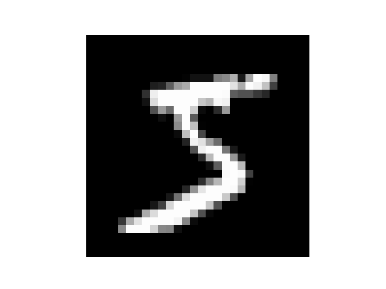

# DeZero-Kai の実装 その19

## Step 51. MNIST
これまでは人工的に生成されたトイデータを用いてモデルの学習などを行ってきましたが、ここからは実際のデータセットを用いてモデルを学習させてみます。
ここでは、手書き数字画像のデータセットである MNIST を用います。
MNIST は [Common Visual Data Foundation (CVDF) の GitHub](https://github.com/cvdfoundation/mnist?tab=readme-ov-file#download) からダウンロードできます。
(オリジナルは [THE MNIST DATABASE](http://yann.lecun.com/exdb/mnist/) というページですが、2024年6月14日現在、アクセス制限でダウンロードできません。)
データセットは圧縮ファイルで配布されており、以下の構成となっています。

- 学習用画像 ([train-images-idx3-ubyte.gz](https://storage.googleapis.com/cvdf-datasets/mnist/train-images-idx3-ubyte.gz))
- 学習用ラベル ([train-labels-idx1-ubyte.gz](https://storage.googleapis.com/cvdf-datasets/mnist/train-labels-idx1-ubyte.gz))
- テスト用画像 ([t10k-images-idx3-ubyte.gz](https://storage.googleapis.com/cvdf-datasets/mnist/t10k-images-idx3-ubyte.gz))
- テスト用ラベル ([t10k-labels-idx1-ubyte.gz](https://storage.googleapis.com/cvdf-datasets/mnist/t10k-labels-idx1-ubyte.gz))

画像データもラベルデータもバイナリデータで、それぞれ以下のような構造になっています。

- 画像データ (train-images-idx3-ubyte.gz, t10k-images-idx3-ubyte.gz)  
  先頭の 16 バイトはデータセット自体の情報、それ以降が画像のピクセル値となっている
    ```
    0000     32 bit integer  0x00000803(2051) magic number
    0004     32 bit integer  60000            number of images
    0008     32 bit integer  28               number of rows
    0012     32 bit integer  28               number of columns
    0016     unsigned byte   ??               pixel
    0017     unsigned byte   ??               pixel
    ........
    xxxx     unsigned byte   ??               pixel
    ```
- ラベルデータ (train-labels-idx1-ubyte.gz, t10k-labels-idx1-ubyte.gz)  
  先頭の 8 バイトはデータセット自体の情報、1バイトごとにデータラベルが格納されている
    ```
    [offset] [type]          [value]          [description]
    0000     32 bit integer  0x00000801(2049) magic number (MSB first)
    0004     32 bit integer  60000            number of items
    0008     unsigned byte   ??               label
    0009     unsigned byte   ??               label
    ........
    xxxx     unsigned byte   ??               label
    ```

まずは、指定された URL のデータをダウンロードする関数 ```get_file``` を ```utils.py``` に定義します。
ダウンロード先として指定されたディレクトリに、すでに同名のファイルがある場合にはファイルパスを返して処理を終了します。

```dzrkai/utils.py```
```python
def show_progress(block_num, block_size, total_size):
    bar_template = "\r[{}] {:.2f}%"

    downloaded = block_num * block_size
    p = downloaded / total_size * 100
    i = int(downloaded / total_size * 30)
    if p >= 100.0: p = 100.0
    if i >= 30: i = 30
    bar = "#" * i + "." * (30 - i)
    print(bar_template.format(bar, p), end='')

def get_file(url, data_dir, file_name=None):
    if file_name is None:
        file_name = url[url.rfind('/') + 1:]
    file_path = os.path.join(data_dir, file_name)

    if os.path.exists(file_path):
        return file_path

    if not os.path.exists(data_dir):
        os.makedirs(data_dir)

    print('Downloading: ' + file_name)
    try:
        urllib.request.urlretrieve(url, file_path, show_progress)
    except (Exception, KeyboardInterrupt) as e:
        if os.path.exists(file_path):
            os.remove(file_path)
        raise
    print('Done')

    return file_path
```

次に、```Dataset``` クラスを継承して ```MNIST``` クラスを作成します。

```dzrkai/datasets.py```
```python
class MNIST(Dataset):
    def __init__(self, train=True, transform=None, target_transform=None, data_dir='/dataset/mnist'):
        self.data_dir = data_dir
        super().__init__(train, transform, target_transform)

    def prepare(self):
        # MNIST のダウンロードサイトの URL
        url = 'https://storage.googleapis.com/cvdf-datasets/mnist/'
        
        # 学習セットのファイル
        train_files = {
            'target': 'train-images-idx3-ubyte.gz',
            'label': 'train-labels-idx1-ubyte.gz'
        }
        
        # テストセットのファイル
        test_files = {
            'target': 't10k-images-idx3-ubyte.gz',
            'label': 't10k-labels-idx1-ubyte.gz'
        }
        
        # 画像・ラベルのファイルパスを取得
        files = train_files if self.train else test_files
        data_path = get_file(url + files['target'], self.data_dir)
        label_path = get_file(url + files['label'], self.data_dir)

        # ファイルから画像とラベルを取得
        self.data = self._load_data(data_path)
        self.label = self._load_label(label_path)

    def _load_data(self, file_path):
        # 最初の16バイトは飛ばして読みだす
        with gzip.open(file_path, 'rb') as f:
            data = np.frombuffer(f.read(), np.uint8, offset=16)
        # 画像サイズ (28x28) に合わせて NCHW にテンソルを整形
        data = data.reshape(-1, 1, 28, 28)
        return data

    def _load_label(self, file_path):
        with gzip.open(file_path, 'rb') as f:
            data = np.frombuffer(f.read(), np.uint8, offset=8)
        return data
```

```_load_data``` では画像データを読み出し、画像形状に合わせてテンソルを整形します。
MNIST の画像はグレースケール (1チャネル) で 28x28 の画像です。
データファイルには、これらの画像がシリアライズされて保存されているので、17バイト目以降のデータを読み込んでから、NCHW の順になるように ```reshape``` しています。
ここで、N はデータ数、 C はチャネル数、H は縦方向のピクセル数、W は横方向のピクセル数をそれぞれ表しています。
整形後の画像データを可視化すると、以下のようになっています。

<div align="center">
    
</div>

この画像を使ってニューラルネットワークを学習するには、前処理を行う必要があります。
具体的には、画像をベクトル化し、データ型を変更して正規化を行います。

```python
def preprocess(x):
    x = x.flatten()
    x = x.astype(np.float32)
    x /= 255.0
    return x
```

これで、データセットを ```Spiral``` から ```MNIST``` に変更するだけで、Step 50 と同じコードで学習を実行できます。
5エポック程度の学習で、テストセットにおいて 86% 前後の精度が得られるようになります。  
最後に、活性化関数を変更してみます。
これまでは Sigmoid 関数を使ってきましたが、ここでは ReLU (Rectified Linear Unit) 関数を使ってみます。

$$
ReLU(x)=
\begin{cases}
    x & \text{if x > 0} \\
    0 & \text{otherwise}
\end{cases}
$$

```dzrkai/functions.py```
```python
class ReLU(Function):
    def forward(self, x):
        y = np.maximum(x, 0.0)
        return y
    
    def backward(self, gy):
        x, = self.inputs
        mask = x.data > 0
        gx = gy * mask
        return gx
    

def relu(x):
    return ReLU()(x)
```

ReLU 関数の逆伝播は、入力が 0 より大きい要素に対応する勾配をそのまま流すだけです。
モデルのインスタンスを作成するコードを、

```python
model = MLP((hidden_size, hidden_size, 10), activation=F.relu)
```

に変更するだけで、5エポック学習後の精度が 93％ 近くまで上昇します。