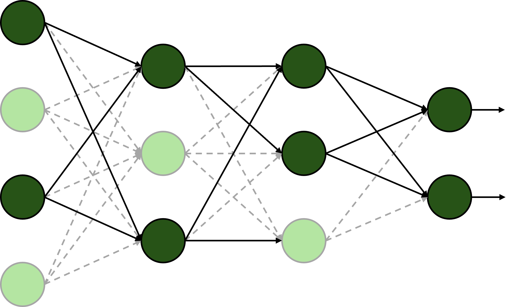

# DeZero-Kai の実装 その21

## Step 53. モデルの保存と読み込み
このステップでは、モデルのパラメータを外部ファイルに保存したり読み込んだりできるようにします。
これによって、モデルの学習結果を保存しておいて、推論のみを実行できるようになります。
パラメータは ```ndarray``` のインスタンスとして保持されているので、NumPy の機能を用いてモデルの保存と読み込みを実現します。  
ある ```ndarray``` インスタンスを1つ保存するには、```np.save``` 関数を使いますが、複数のインスタンスをまとめ保存するには ```np.savez``` 関数を用います。
```np.savez``` では、キーワード引数で変数に名前を付けながら保存することができます。
変数を1個ずつ指定することもできますが、辞書形式でまとめて引き渡すこともできます。

```python
x1 = np.array(...)
x2 = np.array(...)

# 個別に変数を指定
np.savez('test.npz', x1=x1, x2=x2)

# 辞書形式でまとめて指定
data = { 'x1': x1, 'x2': x2 }
np.savez('test.npz', **data)
```

保存先のファイルの拡張子は ```.npz``` になります。
保存したインスタンスは ```np.load``` 関数で読み込むことができます。

```python
data = np.load('test.npz')
x1 = data['x1']
x2 = data['x2']
```

次に、モデルからパラメータを取り出す方法を考えます。
```Layer``` クラスは、階層的に他の ```Layer``` クラスのインスタンスやパラメータを保持しています。
しかし、```np.savez``` 関数でパラメータを保存するには、階層構造を持たない (入れ子になっていないフラットな) 辞書としてパラメータを取り出す必要があります。
そこで、再帰的にパラメータを取得してフラットな辞書に格納していく ```_flatten_params``` メソッドを ```Layer``` クラスに追加します。

```dzrkai/layers.py```
```python
class Layer:
    ...
    def _flatten_params(self, params_dict, parent_key=""):
        for name in self._params:
            obj = self.__dict__[name]
            key = parent_key + '/' + name if parent_key else name

            if isinstance(obj, Layer):
                obj._flatten_params(params_dict, key)
            else:
                params_dict[key] = obj
```

これで、フラットにモデルのパラメータを取り出せるようになったので、モデルのパラメータを保存するメソッド ```save_weights``` と、読み込むメソッド ```load_weights``` を作成します。
ここでは、```np.savez``` の代わりに、圧縮して保存する ```np.savez_compressed``` 関数を使っています。

```dzrkai/layers.py```
```python
class Layer:
    ...
    def save_weights(self, path):
        self.to_cpu()

        params_dict = {}
        self._flatten_params(params_dict)
        array_dict = {key: param.data for key, param in params_dict.items() if param is not None}

        try:
            np.savez_compressed(path, **array_dict)
        except (Exception, KeyboardInterrupt) as e:
            if os.path.exists(path):
                os.remove(path)
            raise

    def load_weights(self, path):
        npz = np.load(path)
        params_dict = {}
        self._flatten_params(params_dict)
        for key, param in params_dict.items():
            param.data = npz[key]
```


## Step 54. Dropout とテストモード
ニューラルネットワークでは、モデルが学習データに過剰に適応する過学習が問題になります。
原因としては、

- データ数が少ないこと
- モデルの表現力が高すぎること

などがあげられます。
1つ目の原因に対しては、データを増やしたり、データ拡張 (data augmentation) で人工的に水増しするなどの対策が取られます。
2つ目の原因に対しては、weight decay や Dropout、batch normalization などの手法が提案されています。
このステップでは Dropout について取り上げ、その実装で必要になるテストモードの判定方法も併せて見ていきます。  
Dropout は、ニューラルネットワークの一部のニューロンをランダムに無効にしながら学習を行う方法です。
消去されたニューロンでは信号の伝達が行われなくなります。

<div align="center">
    
</div>

ランダムなニューロンの消去は、0から1の乱数を生成し、ドロップアウトする割合 (```dropout_ratio```) と比較して、それより大きな要素のみを残すことで実現します。
以下の例では、Dropout の入力を ```x```、出力を ```y``` としています。

```python
dropout_ratio = 0.6
mask = np.random.rand(10) > dropout_ratio

y = x * mask
```

```mask``` は、発生させた乱数が ```dropout_ratio``` より大きな場合に1、それ以外の場合には0となる配列です。
一方、テスト時にはすべてのニューロンを使って推論を行うため、```dropout_ratio``` に合わせて入力をスケールするようにします。

```python
scale = 1 - dropout_ratio
y = x * scale
```

あるいは、テスト時にスケールを合わせる手間を省くために、学習時に出力を ```scale``` の逆数倍しておく方法もあります。

```python
# 学習時
scale = 1 - dropout_ratio
mask = np.random.rand(10) > dropout_ratio
y = x * mask / scale

# テスト時
y = x
```

前者の場合、学習時の ```dropout_ratio``` は常に一定である必要がありますが、後者の方法ではその必要がなくなるという利点があります。  
次に、テストモードを追加します。
逆伝播が不要な時に使う ```no_grad``` の仕組みを使って実装します。

```dzrkai/core.py```
```python
class Config:
    enable_backprop = True
    train = True

...

def test_mode():
    return using_config('train', False)
```

最後に、Dropout の実装は以下の通りです。

```dzrkai/functions.py```
```python
def dropout(x, dropout_ratio=0.5):
    x = as_variable(x)

    if dzrkai.Config.train:
        xp = cuda.get_array_module(x)
        mask = xp.random.rand(*x.shape) > dropout_ratio
        scale = xp.array(1.0 - dropout_ratio).astype(x.dtype)
        y = x * mask / scale
        return y
    else:
        return x
```