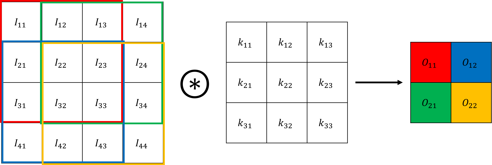
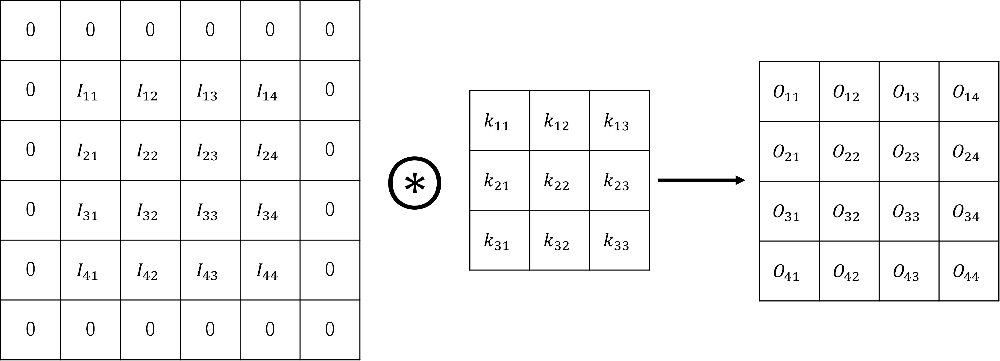
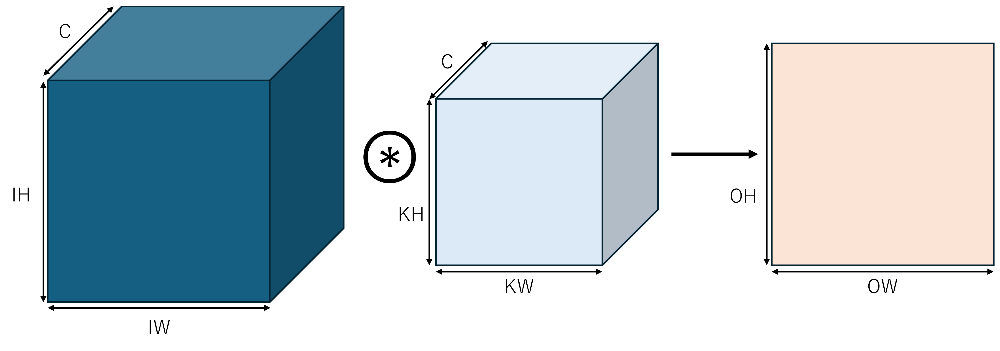
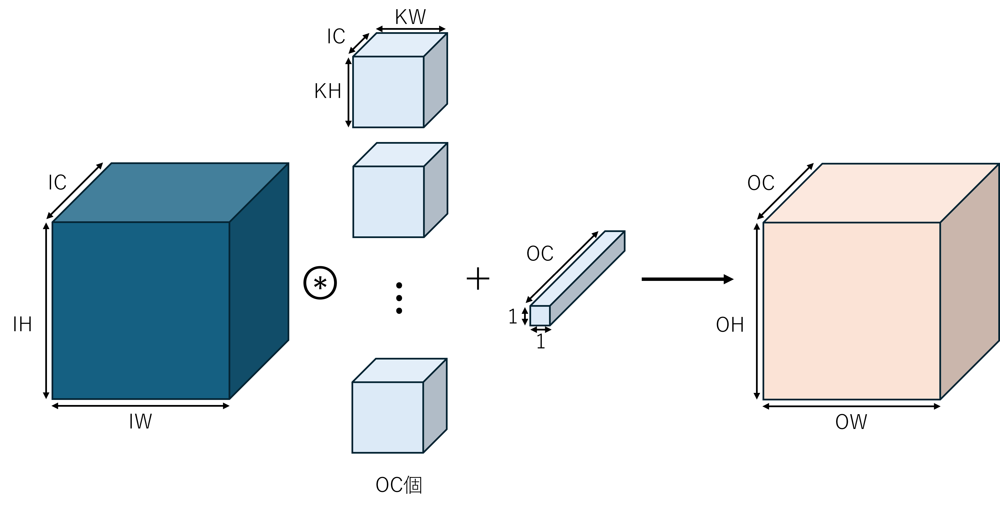
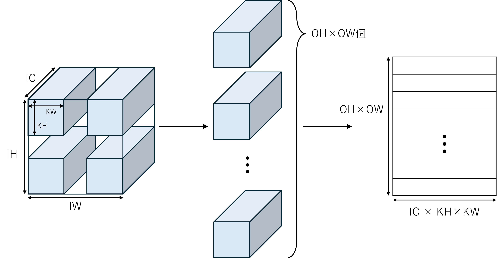
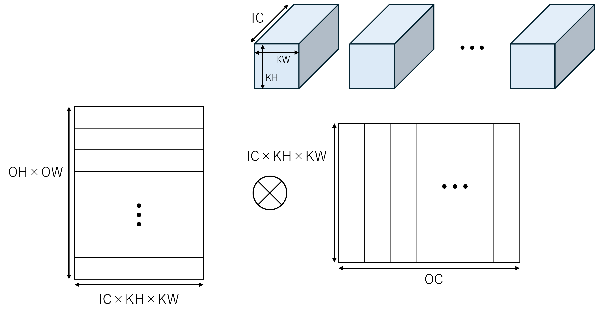

# DeZero-Kai の実装 その21

## Step 55-57. CNN のメカニズムと実装
CNN とは Convolutional Neural Network の略で、日本語では畳み込みニューラルネットワークと訳されます。
画像認識をはじめ、様々な分野で用いられるネットワークについて詳しく見ていきます。

### CNN の構成
CNN は畳み込み演算をを行う畳み込み層 (Convolutional layer) と、プーリング層 (Pooling layer) などを組み合わせて構築します。
活性化関数として ReLU 関数を用いた場合には、「Conv → ReLU (→ Pool)」という塊をいくつもつなげてネットワークを構築します。
この時、プーリング層は省略される場合もあります。
さらに、出力に近い層では「Linear → ReLU」のような組み合わせが使われることもあります。

### 畳み込み演算
畳み込み演算は、画像処理におけるフィルタ演算に相当します。
畳み込み演算におけるフィルタはカーネルとも呼ばれます。
ここで、入力を $4 \times 4$ 行列 $I$、カーネルを $3 \times 3$ 行列 $k$、出力を $2 \times 2$ 行列 $O$ とします。
畳み込み演算は、下の図に示すように、一定間隔ずつカーネルをずらしながら、カーネルサイズの行列で要素積の総和を計算し、それぞれ対応する出力行列の要素に格納します。

<div align="center">
    
</div>

この時、出力の行列の各要素は、以下の式で計算されます。

$$
O_{mn} = \sum_{i=1}^{3}\sum_{j=1}^{3} I_{(m + i - 1)(n + j - 1)} k_{ij}
$$

さらに、出力に対してバイアス $B$ を加算することもあります。
ただし、バイアスは上記の行列に対して1つの値となります。

#### パディング
上記のように処理を行った場合、出力のサイズが入力のサイズに対して小さくなってしまいます。
畳み込み層をいくつも重ねた場合には、層を重ねるごとに出力が縮小し続けます。
これを防ぐために、入力の周囲を0のピクセルで埋めて入力と出力が同じサイズになるように調整します。
この調整をパディング (Padding) と呼びます。

<div align="center">
    
</div>

#### ストライド
畳み込み演算でカーネルをずらす間隔をストライド (Stride) と呼びます。
上記の例では、ストライドを1としていますが、任意の整数を設定することができます。

#### 出力サイズの計算
畳み込み演算の出力サイズは、入力サイズとパディングサイズ、ストライドによって決まります。

$$
output\_size = (input\_size + padding\_size - kernel\_size) // stride + 1
$$

#### 3階テンソル
ここまで、2次元の入力と2次元のカーネルの畳み込み演算を見てきました。
しかし、実際の画像では RGB のようにチャネル方向にもデータを持ちます。
すなわち、3次元データ (3階テンソル) 同士の畳み込みを扱う必要があります。
3階テンソル同士の畳み込み演算は以下のようになります。

<div align="center">
    
</div>

ここで、入力とカーネルのチャネル数 $C$ は必ず同じである必要があります。
入力とカーネルの各チャネルで畳み込み演算を行い、さらに、同じ範囲の畳み込み演算の結果を全て足し合わせます。
データの並びは $(channel, height, width)$ で表現され、入力 $(C, IH, IW)$ とカーネル $(C, KW, KH)$ の畳み込み演算の出力は、$(1, OH, OW)$ となります。  
さらに、出力もチャネル数 $OC$ の3階テンソルとなるように、カーネルを $OC$ 個用意したのが下の図となります。

<div align="center">
    
</div>

入力 $(IC, IH, IW)$ とカーネル $(OC, IC, IH, IW)$ の演算結果は $(OC, OH, OW)$ となります。
この場合、バイアスは $(OC, 1, 1)$ で各出力チャネルに1つずつのスカラ値を加算します。  
データを $N$ 個束ねてミニバッチ処理をする場合、データは4階テンソルとなります。
この時、入力は $(N, IC, IH, IW)$、出力は $(N, OC, OH, OW)$ です。

#### im2col による展開
これまでに説明してきたようなテンソル演算を、Python で素直に実装しよとすると、```for``` 文が繰り返し現れ、処理の効率が悪くなってしまいます。
そこで、NumPy を使って計算しやすいように、カーネルを適用するテンソル内の領域を取り出して行列に変換します。
これが、```im2col``` 関数による処理です。

<div align="center">
    
</div>

実際には、1段目の変換さえしておけば NumPy のテンソル積で計算できます。
一方、カーネルは以下のように変換し、行列演算によって畳み込み演算を実現します。

<div align="center">
    
</div>

```im2col``` 関数と、その元となる ```Im2col``` クラスは、```dzrkai/functions_conv.py``` に実装します。
逆伝播関数の実装や GPU 対応などでかなりの分量になるので、直接コードを参照してください。  
これで2次元畳み込みを実装する準備ができました。

#### 順伝播
```im2col``` 関数では、$(N, IC, IH, IW)$ の入力テンソルを $(N, IC, KH, KW, OH, OW)$ の6次元テンソルに展開します。
一方、重み ```W``` は $(OC, IC, KH, KW)$ の4次元テンソルです。
前項の計算方法では、入力テンソルと重みをどちらも2次元の行列にさらに展開して行列積を計算していましたが、実装では NumPy の ```tensordot``` 関数を使っています。
この関数では、テンソル積を計算するテンソルを第1、第2引数に取り、```axis``` に軸となる次元を指定します。
軸となる次元は、各テンソルで同じ大きさを持つ次元です。
ここでは、$IC$、$KH$、$KW$ が該当するので、```axis=((1, 2, 3), (1, 2, 3))``` と指定します。
これにより、展開後の入力テンソルと重みのテンソル積が計算され、$(N, OH, OW, OC)$ の4次元テンソルが得られます。
バイアスがある場合にはバイアスを加算し、最終的には軸を入れ替えて $(N, OC, OH, OW)$ のテンソルを出力します。

#### 逆伝播
逆伝播では、出力側から $(N, OC, OH, OW)$ の4次元テンソルが渡されます。
ここで、ある2つの関数 $f$ と $g$ の畳み込み演算 $f * g$ の微分 $D(f * g)$ ($D$ は微分演算子) は、以下のように表されます。

$$
D(f * g) = Df * g = f * Dg
$$

すなわち、畳み込み演算の微分は一方の微分と、もう一方の畳み込み演算で表されます。
より具体的には、入力画像 $x$ に関する微分は、伝播された微分値 $gy$ と畳み込みカーネルの重み $W$ の畳み込みで、畳み込みカーネルの重み $W$ に関する微分は、伝播された微分値 $gy$ と入植画像 $W$ の畳み込みで、それぞれ表されます。
順伝播の時と同様に、```np.tensordot``` 関数で軸を指定してテンソル積を計算することで実装します。  
また、バイアスの微分は出力チャネル方向に伝播された微分値の和を計算することで求められます。

### プーリング層
プーリング層は縦・横方向の空間を縮小する演算です。
一定範囲内の最大値をとる最大値プーリング (Max Pooling) や、平均値をとる平均値プーリング (Average Pooling) があります。
また、プーリング層には以下のような特徴があります。

- 畳み込み層とは異なり学習パラメータがない
- 縦・横方向のサイズ変化だけでチャネル数が不変
- 入力データの微小な位置変化に対してロバストになる

プーリングも、畳み込みと同じく ```im2col``` を使って入力画像を変換します。
```im2col``` の出力は $(N, IC, KH, KW, OH, OW)$ の6次元ですが、これを $(N, IC, KH \times KW, OH, OW)$ の5次元テンソルに変形し、$KH \times KW$ の軸について最大値を取ります。
逆伝播では、カーネル内の最大値を取る座標に、渡された微分値をそのまま入れて返します。